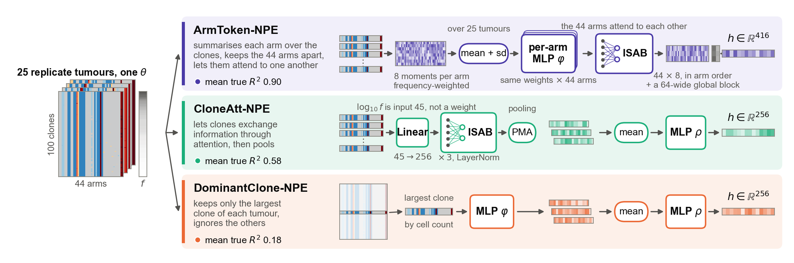
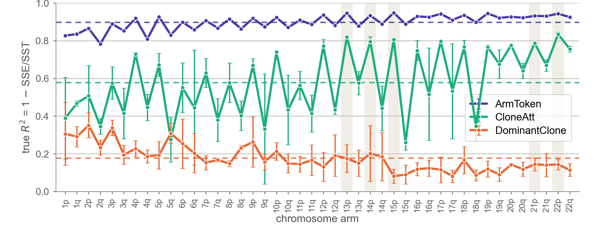
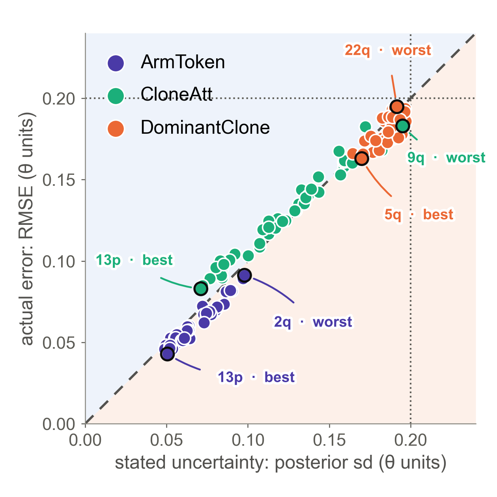
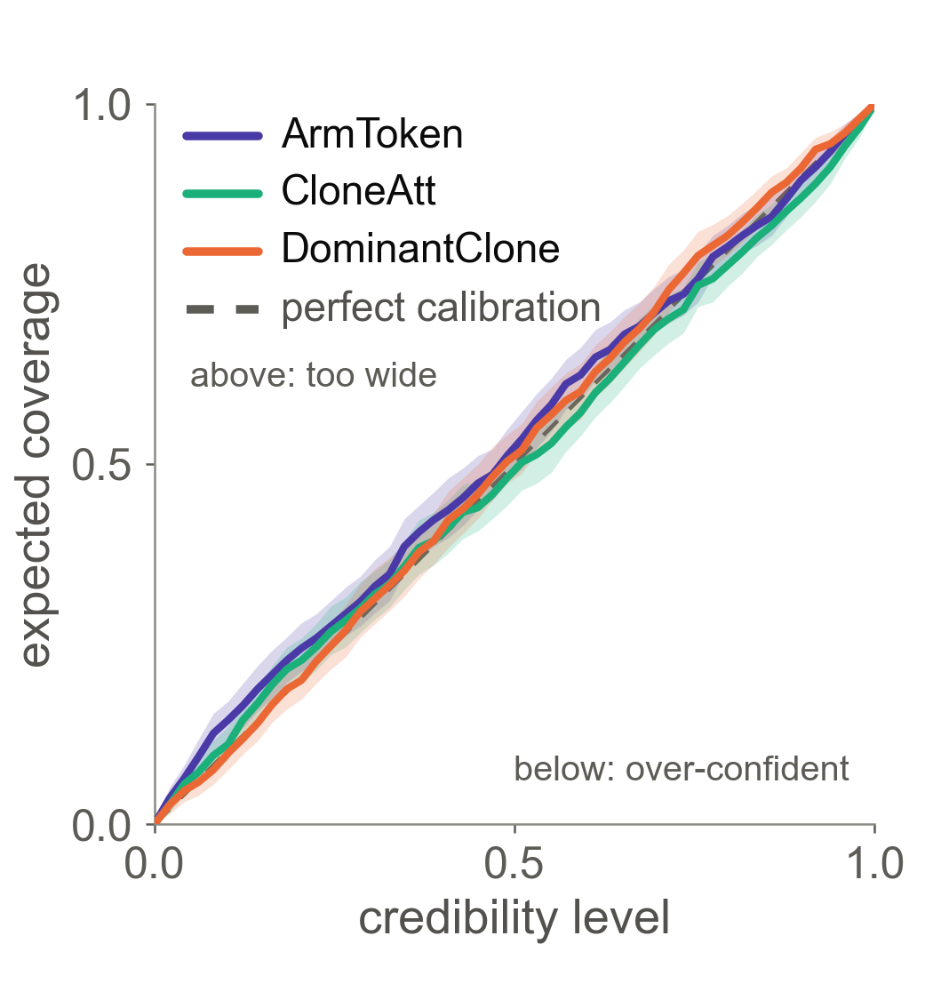

# Selection coefficients from clonal copy-number data

Given the copy-number profiles of the clones inside a single tumour, infer the **44 chromosome-arm
selection coefficients** (22 chromosomes × p/q arms) that produced it, with calibrated uncertainty.

There is no likelihood: tumour evolution exists only as a forward simulator. So tumours are
generated by SISTEM under known coefficients, and a **neural posterior estimator** — a normalising
spline flow conditioned on a learned embedding of the tumour's clone set — is trained on those
simulations to approximate the posterior over the 44 coefficients. Four embeddings are compared.
The flow family and the training loop are shared, so the comparison is about how the clone set is
summarised before the flow sees it.

Selection is modelled **at the chromosome-arm level**: SISTEM's arm model gives one coefficient θ
per arm and no fitness to individual genes or point mutations, and focal copy-number events act only
through an arm's average copy number. The recovered landscape is therefore arm-level by
construction, not by discovery.

Each training example is one simulation: **25 replicate tumours grown from a single θ**, with
θ ~ N(0, 0.2) drawn independently per arm.

## Results

All four encoders, each in its **best honest configuration**, scored on the **same 651 held-out
simulations** with 5,000–15,000 posterior draws each. "Honest" means calibration was required first
and accuracy quoted with its seed spread, never a single lucky run. Tables and figures are in
[`results/best_honest/`](results/best_honest/); the full campaign of 78 runs behind these choices is
`docs/CAMPAIGN_REPORT_2026-09-24.md` (kept locally; `docs/` is not in version control).

| Encoder | Run | true R² (seeds) | log p(θ\*) | 95 % cov. | SBC fails /44 | TARP |
| --- | --- | --- | --- | --- | --- | --- |
| **ArmToken-NPE** | `AT0ens3` | **0.898 ± 0.002** | **68.0** | 0.961 | 21 | 0.022 wide |
| CloneAtt-NPE | `R26` | 0.579 ± 0.015 | 29.8 | 0.930 | 28 | 0.016 tight |
| CloneMLP-NPE | `R2` | 0.363 ± 0.053 | 17.8 | 0.938 | 20 | 0.080 wide |
| DominantClone-NPE | `D0` | 0.177 ± 0.017 | 11.7 | 0.954 | 9 | 0.011 wide |
| *returning the prior* | — | 0.000 | −8.23 | — | — | — |

The last row sets the scale. The **prior bar**, −8.23 nats, is the differential entropy of
N(0, 0.2007) in 44 dimensions: the log density a model earns by ignoring the data entirely. Every
encoder clears it, but the spread between them is wide. **ArmToken-NPE recovers five times as much
variance as the largest-clone baseline** and assigns the true coefficients far more density than any
other encoder, while staying close to calibrated.

### The four encoders



*Three of the four, from the clone matrix to the context vector the flow reads. CloneMLP is not
shown; it pools the same clone set with a plain frequency-weighted mean.*

| Encoder | How it summarises the tumour | Encoder weights | Context |
| --- | --- | --- | --- |
| **ArmToken-NPE** | 8 frequency-weighted statistics per arm, one shared MLP across all 44 arms, one ISAB so arms can attend to one another, then a per-arm head and a whole-tumour head | **61,832** | 416 |
| CloneAtt-NPE | Set Transformer over the clones: linear projection, 3 × ISAB, PMA pooling | 2,017,792 | 256 |
| CloneMLP-NPE | per-clone MLP, frequency-weighted mean pooling | 209,536 | 256 |
| DominantClone-NPE | DeepSet over replicates, largest clone only | 11,744 | 128 |

The result the project turns on: **ArmToken carries 33× fewer encoder weights than CloneAtt and
recovers 0.90 against 0.58.** Capacity was never the limit. Sharing one set of weights across the 44
arms is what unlocks the signal, because a gradient step then learns "how to read an arm" from 44
times as many examples, and the flow still receives the 44 blocks in chromosome order so arm
identity is preserved.

### Accuracy, arm by arm



ArmToken leads on **all 44 arms**. For every encoder, p arms are recovered better than q arms, and
accuracy rises with chromosome number for the clone-set models — small arms are easier, because one
focal event moves a small arm's average copy number much further.

### Are the error bars honest?



One dot per arm: the posterior's stated standard deviation against the actual RMSE of the posterior
mean, both in θ units. The dashed diagonal is honesty. Points above it are over-confident, below it
under-confident, and points nearer the origin have learned more. ArmToken sits near the diagonal at
roughly a third of the prior's width; DominantClone sits near the prior line, which is the prior
handed back.



TARP (Lemos et al. 2023) tests the **joint** posterior over all 44 arms rather than each arm alone.
All three poster encoders stay within 0.022 of the diagonal. Marginal SBC is stricter at n = 651 and
still flags arms for every model, which is expected: a small bias fails a rank test long before it
matters for coverage. The reasoning behind this metric set is
`docs/EVALUATION_PRACTICE_REVIEW.md`.

### Reading the metrics

- **true R² = 1 − SSE/SST**, not squared Pearson r². The two differ by the systematic scale-and-
  offset error in the posterior mean, and that gap is not noise: squared Pearson r² flatters a model
  whose posterior mean is consistently off-scale.
- **log p(θ\*)** is the log density the posterior assigns to the true coefficients. Above −8.23 nats
  means the model beat the prior.
- **TARP distance** is the mean absolute gap to the diagonal; the direction says whether the
  posterior is too wide (positive) or over-confident (negative).
- **A difference smaller than the seed band is noise.** The bands run from ±0.002 (ArmToken) to
  ±0.053 (CloneMLP).

## Reproducing each encoder's best result

Since 2026-09-25 the presets **default to the repaired configurations**, so the name alone builds
the row in the table above:

```bash
python -m cancer_sbi.cli.train --model armtoken       --tail-bound 5   # AT0
python -m cancer_sbi.cli.train --model cloneatt                        # R26
python -m cancer_sbi.cli.train --model clonemlp                        # R2
python -m cancer_sbi.cli.train --model dominantclone                   # D0
```

`AT0ens3`, the headline ArmToken row, is an equal-weight mixture of three seeds of `AT0`, built by
[`src/jobs/ensemble.sh`](src/jobs/ensemble.sh). The full evaluation set for all four is regenerated
by [`src/jobs/best_honest.sh`](src/jobs/best_honest.sh), which reads its run list from
[`src/cancer_sbi/evaluation/manifests/best_honest_2026-09-24.json`](src/cancer_sbi/evaluation/manifests/best_honest_2026-09-24.json)
— the single source of truth for which run is each encoder's headline.

The models **as originally published** are preserved byte for byte as `clonemlp_published`,
`cloneatt_published` and `dominantclone_published`, reached with `--published` or by naming the
suffix. Their evaluation is in [`results/published/`](results/published/): true R² 0.472, 0.049 and
0.170 respectively, the first of those with 39 of 44 arms failing SBC — it was sharp because it was
over-confident. ArmToken has no published twin; it was built during the repair campaign.

## Layout

```
src/
  cancer_sbi/            the package
    config.py              one frozen ModelPreset per model, repaired + published twins
    arms.py                chromosome-arm naming and ordering
    data/                  clone_sets.py, dominant_clone.py, loaders.py, splits.py
    models/                arm_tokens.py (ArmToken), set_transformer.py (CloneAtt),
                           mlp_encoder.py (CloneMLP), deep_set.py (DominantClone),
                           hybrid.py, trials.py, flow.py
    training/              trainer.py, checkpoints.py
    evaluation/            sample_posteriors.py, poster_metrics.py, tarp.py,
                           best_honest_figures.py, ensemble_posteriors.py,
                           recalibrate_posteriors.py, manifests/
    cli/                   train.py, evaluate.py, make_split.py
  jobs/                  SLURM scripts; see jobs/README.md
  baselines/             ridge regression on per-arm summary statistics
  utilities/             campaign summary, cache builders, loss curves
  data_generation/       the simulators that produced the dataset
  verify_refactor.py     proves cancer_sbi matches the original scripts, check by check

results/
  best_honest/           one folder per encoder: the headline run, its seed siblings, figures
  published/             the three original checkpoints, evaluated before any repair
  2026-09-24/            every run of the campaign
overview_figure/poster/  the NECB poster: source, panels and the printed PDF
data/, runs/             simulated data and checkpoints (not tracked, cluster-side)
```

### Per-run evaluation files

Each run folder under `results/best_honest/<encoder>/<run>/` holds `metrics_summary.csv`,
`metrics_per_arm.csv`, `coverage_curve.csv`, `shrinkage.csv`, `tarp_curve.csv`,
`tarp_summary.json`, `summary_arrays.npz` and figures A–D, S1 and T. The cross-encoder comparisons
— `fig_E_per_arm_r2`, `fig_calibration_panel`, `fig_S3_per_arm_coverage`, `fig_D_panel` and
`headline_table.md` — are in `results/best_honest/figures/`.

## The dataset

Not in version control. It lives on the cluster at `~/cancer/data/Guassian_Normal/simulation_outputs`
(3,600 simulations, ~14 GB); a partial 888-simulation subset is kept locally for testing.

```
simulation_outputs/
  sim<N>/
    parameters.pkl          46 floats; [2:] are the 44 selection coefficients.
                            The first two are nuisance rates the models never predict.
    <1..25>/                one directory per replicate tumour
      CNratios_all.pkl.gz   (n_cells, 44) log2 copy-number ratios - what the clone-set models read
      results.pkl           3-tuple; [1] is the largest clone - what DominantClone reads
      sim.log
```

**3,159 of the 3,600 simulations survive the all-25-replicates filter**, split
**2,261 train / 247 validation / 651 test** by parameter setting. Every number in this README is on
those 651 test cases.

Properties worth knowing before modelling against it:

- A typical replicate has **~1,600 distinct clone profiles**, so `top_k=100` is a hard truncation
  covering a median of only **45 %** of cells. There is no dominant clone: the largest is typically
  1.5 % of the population.
- **19.9 %** of copy-number entries are exactly −10.966, the sentinel for total arm loss, and
  **52.1 %** are exactly 0. Overall standard deviation 4.34.
- Replicates of the same simulation correlate at r ≈ 0.74, so the 25 replicates carry real
  stochastic variation rather than being near-copies.
- The clone-set encoders read **copy space**, not the stored log2 ratios:
  `c = (clamp(2^(x+1), 0, 8) − 2) / 2`, so 0 is diploid and −1 is total loss.

`docs/DATA_GENERATION.md` (local, not tracked) is the authoritative reference for how the
simulations were produced.

## Running it

Configured by environment variable or by flag:

```bash
export CANCER_SBI_DATA_ROOT=~/cancer/data/Guassian_Normal/simulation_outputs
export CANCER_SBI_SPLIT=~/cancer/data/train_test_split.pkl
export CANCER_SBI_RUNS=~/cancer/runs
```

On the cluster everything goes through SLURM — `/home` is mounted `noexec`, so nothing runs on the
login node:

```bash
cd ~/cancer/src
sbatch jobs/best_honest.sh                       # re-evaluate all four headline runs
MODEL=armtoken sbatch jobs/sample.sh             # draw posteriors for one model
sbatch jobs/analyze.sh                           # metrics, figures and TARP
EXTRA="--limit 4" MODEL=armtoken sbatch jobs/sample.sh   # smoke test
```

Or directly:

```bash
python -m cancer_sbi.evaluation.sample_posteriors --model armtoken --out-dir results/posteriors
python -m cancer_sbi.evaluation.poster_metrics    --in-dir results/posteriors --out-dir results
python -m cancer_sbi.evaluation.tarp              --in-dir results/posteriors --out-dir results
python -m cancer_sbi.cli.train --model armtoken --tail-bound 5 --ckpt-dir runs/armtoken
```

Inside any job script, after `conda activate`:

```bash
export LD_LIBRARY_PATH="$CONDA_PREFIX/lib${LD_LIBRARY_PATH:+:$LD_LIBRARY_PATH}"
```

Without it, conda's SciPy fails to load against the system `libstdc++`.

## Verifying the refactor

`cancer_sbi` is a refactor of three sets of per-model scripts. `verify_refactor.py` proves it
computes the same things — not approximately, element by element:

```bash
python src/verify_refactor.py \
    --data-root data/Guassian_Normal/simulation_outputs \
    --legacy-root _archive_2026-09-23 \
    --with-models
```

It checks the data pipeline, model construction (identical parameter names, shapes, initial weights
under a fixed seed, and forward passes) and every configuration value. **42 of 42 checks pass** on
both the laptop and the cluster.

## Environment

Conda environment `cancer` locally, `cancer-sbi` on the cluster: `torch`, `sbi` 0.25.0, NumPy ≥ 2
(the pickles were written with it), plus `sistem` and `mpi4py` for the simulators.

## Known limitations

- **25 replicates, not one.** Training and testing condition on 25 replicate tumours grown from the
  same θ. A patient provides one. Evaluating at a single tumour is the next step.
- **Exact simulator copy numbers.** No cell sampling, no read-depth noise, no copy-number calling
  error and no clone inference. The frequencies are shares of clone objects, not of sequenced cells.
- **Arm-level selection only.** Gene-level drivers and point mutations carry no fitness in this
  simulator setting, so an arm's inferred θ would absorb any gene-level selection sitting on it.
- **Simulated data throughout.** No real tumour has been run through these models yet.

## Not in this repository

Simulated data (21 GB), model checkpoints (2 GB), posterior sample dumps (~530 MB each), job logs,
`docs/`, the poster's working scripts and drafts, and the superseded pre-refactor model folders. All
live on the cluster or in dated local backups.
